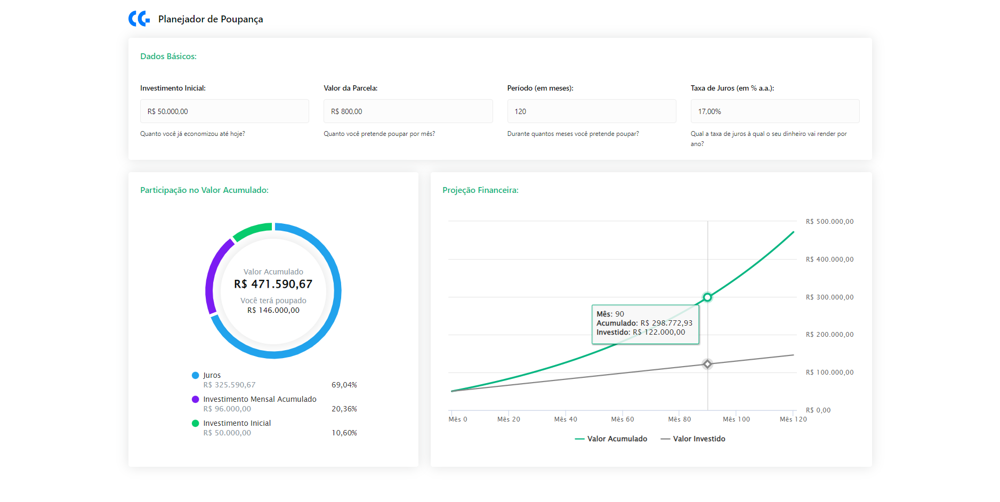

## Como executar

Primeiro, execute o servidor de desenvolvimento:

```bash
npm run dev
# ou
yarn dev
```

Acesse [http://localhost:3000](http://localhost:3000) no seu navegador para ver o resultado.

## Objetivo

- Implementar o Planejador de Poupança conforme o design proposto.

## Instruções

- Os dados devem ser formatados exatamente como apresentados no design (ex.: valores percentuais com duas casas decimais seguidas de "%").
- Os inputs do componente Dados Básicos devem apresentar as máscaras indicadas no design.
- Quando todos os inputs forem preenchidos, os componentes de output (Participação no Valor Acumulado e Projeção Financeira) deverão ser atualizados.
- A legenda do gráfico de Participação no Valor Acumulado deve ser ordenada pelo percentual de participação, do maior para o menor.
- Em relação ao gráfico de Projeção Financeira, na interface, as proporções podem estar fora de escala. Então se atente aos valores e não à correspondência entre os pontos e os seus respectivos valores.

## Requisitos Técnicos

- Tecnologias
  - Next.js sem TypeScript.
  - Estilização dos componentes com Tailwind CSS e uso de componentes do Ant Design.
  - Uso da biblioteca Highcharts para a criação dos gráficos.
  - Endpoint GraphQL com Apollo Server para a implementação das APIs.
  - Cliente GraphQL com Apollo Client para o consumo das APIs.
